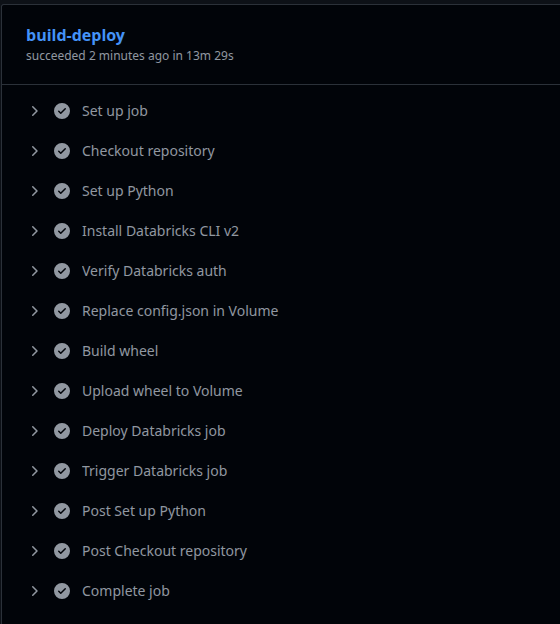

# CI/CD for Brazilian Data ETL Pipeline

This repository contains the **Brazilian E-commerce Data ETL pipeline**. We have set up a **CI/CD workflow** using **GitHub Actions** to automate the deployment of Databricks jobs.

## CI/CD Workflow Overview

1. **Build**  
   - The Python wheel package is built from the source code in the `src/` directory.  
   - The package is stored in the `dist/` folder for deployment.

2. **Databricks Deployment**  
   - The workflow triggers Databricks jobs using the Databricks CLI.  
   - Job configurations are maintained in JSON files (`databricks_reset_job.json`) for easy management.  
   - The jobs are reset or updated automatically to reflect the latest code changes.

3. **Secrets Management**  
   - Sensitive information such as `DATABRICKS_HOST`, `DATABRICKS_TOKEN`, and `JOB_ID` are stored securely in GitHub Secrets.  
   - The workflow retrieves them dynamically during deployment to authenticate with Databricks.

4. **Job Trigger**  
   - Once the deployment is complete, the workflow triggers the job run in Databricks using the job ID from secrets.  
   - Logs can be monitored in Databricks to track execution status.

## Pipeline Screenshot

## Databricks Jobs Screenshot

---

With this CI/CD setup, any commit to the main branch automatically deploys the latest ETL pipeline to Databricks, ensuring consistency and faster delivery.
